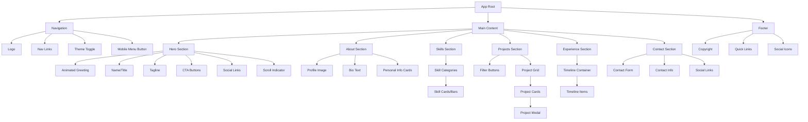
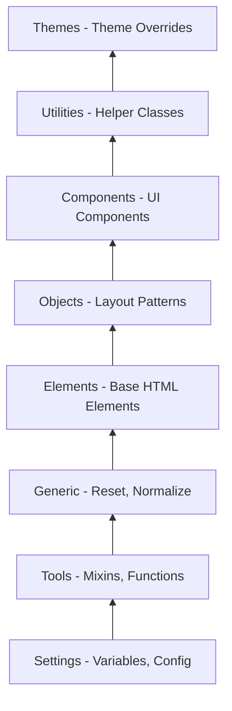
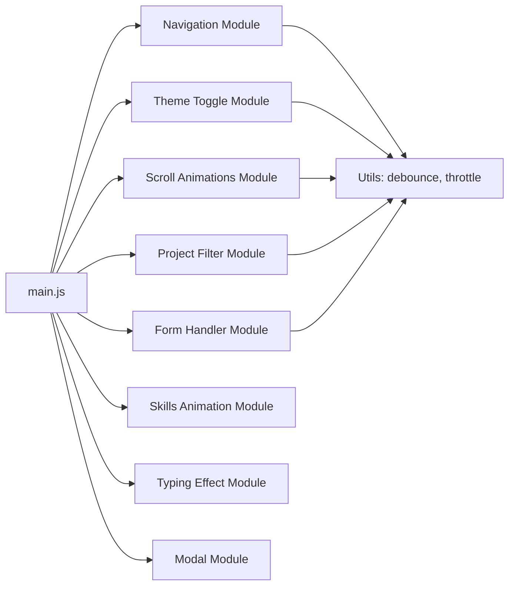
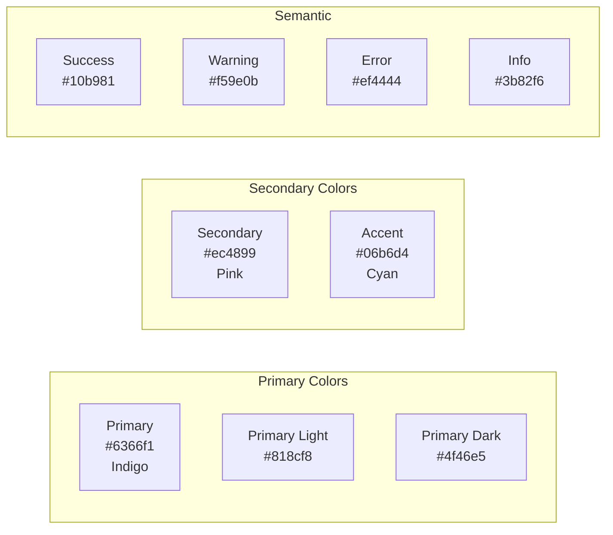
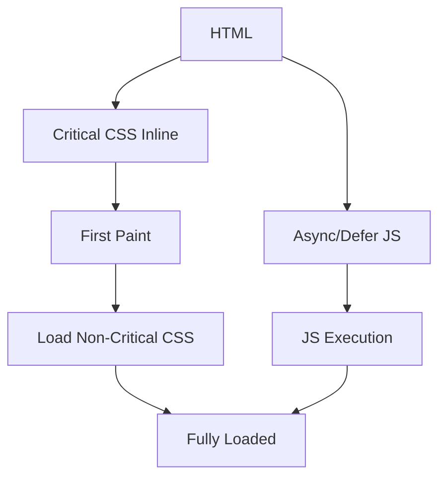

# Personal Portfolio Website Architecture

## Overview

This document outlines the comprehensive architecture for a modern, responsive Personal Portfolio Website with dark/light mode support. The architecture prioritizes performance, accessibility, and maintainability while delivering a visually stunning user experience.

---

## Table of Contents

1. [Project File Structure](#1-project-file-structure)
2. [Component Breakdown](#2-component-breakdown)
3. [CSS Architecture](#3-css-architecture)
4. [JavaScript Functionality](#4-javascript-functionality)
5. [Color Scheme & Design Tokens](#5-color-scheme--design-tokens)
6. [Animation & Interactions](#6-animation--interactions)
7. [Accessibility Considerations](#7-accessibility-considerations)
8. [Performance Optimization](#8-performance-optimization)

---

## 1. Project File Structure

```
portfolio-website/
|-- index.html
|-- favicon.ico
|-- robots.txt
|-- sitemap.xml
|
|-- css/
|   |-- main.css                 # Main stylesheet (imports all partials)
|   |-- variables.css            # CSS custom properties/design tokens
|   |-- reset.css                # CSS reset/normalize
|   |-- base.css                 # Base element styles
|   |-- typography.css           # Font definitions and text styles
|   |-- layout.css               # Grid system and container styles
|   |-- components/
|   |   |-- navigation.css       # Navigation component styles
|   |   |-- hero.css             # Hero section styles
|   |   |-- about.css            # About section styles
|   |   |-- skills.css           # Skills section styles
|   |   |-- projects.css         # Projects section styles
|   |   |-- experience.css       # Experience section styles
|   |   |-- contact.css          # Contact section styles
|   |   |-- footer.css           # Footer styles
|   |   |-- buttons.css          # Button component styles
|   |   |-- cards.css            # Card component styles
|   |   |-- forms.css            # Form element styles
|   |   |-- theme-toggle.css     # Theme toggle switch styles
|   |   -- modal.css             # Modal/lightbox styles
|   |-- utilities.css            # Utility classes
|   -- themes/
|       |-- dark.css             # Dark theme overrides
|       -- light.css             # Light theme overrides (default)
|
|-- js/
|   |-- main.js                  # Main JavaScript entry point
|   |-- modules/
|   |   |-- navigation.js        # Mobile menu and smooth scroll
|   |   |-- theme-toggle.js      # Dark/light mode functionality
|   |   |-- scroll-animations.js # Intersection Observer animations
|   |   |-- project-filter.js    # Project filtering logic
|   |   |-- form-handler.js      # Contact form validation/submission
|   |   |-- skills-animation.js  # Skill bars animation
|   |   |-- typing-effect.js     # Hero typing animation
|   |   -- modal.js              # Modal/lightbox functionality
|   -- utils/
|       |-- debounce.js          # Debounce utility
|       -- throttle.js           # Throttle utility
|       -- localStorage.js       # Local storage helpers
|
|-- assets/
|   |-- images/
|   |   |-- profile/             # Profile pictures
|   |   |-- projects/             # Project screenshots
|   |   |-- icons/               # Icon assets (if not using icon font)
|   |   |-- backgrounds/         # Background images/patterns
|   |   -- og-image.jpg          # Social media preview image
|   |-- fonts/
|   |   |-- inter/               # Inter font family
|   |   -- jetbrains-mono/       # Monospace font for code
|   |   -- font-face.css         # Font-face declarations
|   -- videos/
|       -- hero-background.mp4   # Optional hero video
|
|-- vendor/
|   |-- normalize.css            # CSS normalize
|   -- (other third-party libs)
|
|-- README.md
|-- LICENSE
-- package.json                  # Project metadata and scripts
```

---

## 2. Component Breakdown

### 2.1 Component Hierarchy Diagram



### 2.2 Component Specifications

#### Navigation Component
| Property | Specification |
|----------|---------------|
| Type | Sticky/Fixed header |
| Behavior | Transparent on hero, solid on scroll |
| Mobile | Hamburger menu with slide-in panel |
| Animation | Smooth background color transition |
| Position | Fixed top, full width |

#### Hero Section
| Property | Specification |
|----------|---------------|
| Height | 100vh (full viewport) |
| Content | Centered, animated text |
| Animation | Typing effect, fade-in elements |
| Background | Gradient or subtle pattern |
| CTA | Primary and secondary buttons |

#### About Section
| Property | Specification |
|----------|---------------|
| Layout | Two-column (image + text) |
| Image | Circular/rounded with border |
| Animation | Slide-in on scroll |
| Content | Bio, quick facts, download CV button |

#### Skills Section
| Property | Specification |
|----------|---------------|
| Layout | Grid of skill cards or progress bars |
| Categories | Grouped by type (Frontend, Backend, Tools) |
| Animation | Progress bars animate on scroll into view |
| Visual | Icons + percentage bars or radial charts |

#### Projects Section
| Property | Specification |
|----------|---------------|
| Layout | Masonry or grid layout |
| Filtering | Category filter buttons |
| Cards | Image, title, tech stack, links |
| Modal | Detailed view with carousel |
| Animation | Staggered fade-in |

#### Experience Section
| Property | Specification |
|----------|---------------|
| Layout | Vertical timeline |
| Items | Company, role, date, description |
| Animation | Items reveal on scroll |
| Visual | Alternating left/right on desktop |

#### Contact Section
| Property | Specification |
|----------|---------------|
| Layout | Two-column (form + info) |
| Form | Name, email, subject, message |
| Validation | Real-time with visual feedback |
| Submit | AJAX submission with loading state |

#### Footer
| Property | Specification |
|----------|---------------|
| Content | Copyright, quick links, social icons |
| Layout | Three sections or centered |
| Sticky | Optional sticky footer |

---

## 3. CSS Architecture

### 3.1 Methodology: BEM + ITCSS

The CSS architecture follows a hybrid approach combining:
- **ITCSS** (Inverted Triangle CSS) for layer organization
- **BEM** (Block Element Modifier) for naming convention

### 3.2 ITCSS Layers



### 3.3 BEM Naming Convention

```css
/* Block */
.skill-card { }

/* Element */
.skill-card__icon { }
.skill-card__title { }
.skill-card__progress { }

/* Modifier */
.skill-card--featured { }
.skill-card--dark { }
```

### 3.4 CSS Custom Properties Structure

```css
:root {
  /* === DESIGN TOKENS === */
  
  /* Colors - Light Theme (Default) */
  --color-primary: #6366f1;
  --color-primary-light: #818cf8;
  --color-primary-dark: #4f46e5;
  --color-secondary: #ec4899;
  --color-accent: #06b6d4;
  
  /* Neutrals */
  --color-white: #ffffff;
  --color-black: #0f172a;
  --color-gray-50: #f8fafc;
  --color-gray-100: #f1f5f9;
  --color-gray-200: #e2e8f0;
  --color-gray-300: #cbd5e1;
  --color-gray-400: #94a3b8;
  --color-gray-500: #64748b;
  --color-gray-600: #475569;
  --color-gray-700: #334155;
  --color-gray-800: #1e293b;
  --color-gray-900: #0f172a;
  
  /* Semantic Colors */
  --color-success: #10b981;
  --color-warning: #f59e0b;
  --color-error: #ef4444;
  --color-info: #3b82f6;
  
  /* Typography */
  --font-family-primary: 'Inter', -apple-system, BlinkMacSystemFont, sans-serif;
  --font-family-mono: 'JetBrains Mono', 'Fira Code', monospace;
  
  --font-size-xs: 0.75rem;    /* 12px */
  --font-size-sm: 0.875rem;   /* 14px */
  --font-size-base: 1rem;     /* 16px */
  --font-size-lg: 1.125rem;   /* 18px */
  --font-size-xl: 1.25rem;    /* 20px */
  --font-size-2xl: 1.5rem;    /* 24px */
  --font-size-3xl: 1.875rem;  /* 30px */
  --font-size-4xl: 2.25rem;   /* 36px */
  --font-size-5xl: 3rem;      /* 48px */
  --font-size-6xl: 3.75rem;   /* 60px */
  
  --font-weight-normal: 400;
  --font-weight-medium: 500;
  --font-weight-semibold: 600;
  --font-weight-bold: 700;
  
  --line-height-tight: 1.25;
  --line-height-normal: 1.5;
  --line-height-relaxed: 1.75;
  
  /* Spacing Scale (8px base) */
  --space-1: 0.25rem;   /* 4px */
  --space-2: 0.5rem;    /* 8px */
  --space-3: 0.75rem;   /* 12px */
  --space-4: 1rem;      /* 16px */
  --space-5: 1.25rem;   /* 20px */
  --space-6: 1.5rem;    /* 24px */
  --space-8: 2rem;      /* 32px */
  --space-10: 2.5rem;   /* 40px */
  --space-12: 3rem;     /* 48px */
  --space-16: 4rem;     /* 64px */
  --space-20: 5rem;     /* 80px */
  --space-24: 6rem;     /* 96px */
  
  /* Border Radius */
  --radius-sm: 0.25rem;
  --radius-md: 0.5rem;
  --radius-lg: 0.75rem;
  --radius-xl: 1rem;
  --radius-2xl: 1.5rem;
  --radius-full: 9999px;
  
  /* Shadows */
  --shadow-sm: 0 1px 2px 0 rgb(0 0 0 / 0.05);
  --shadow-md: 0 4px 6px -1px rgb(0 0 0 / 0.1);
  --shadow-lg: 0 10px 15px -3px rgb(0 0 0 / 0.1);
  --shadow-xl: 0 20px 25px -5px rgb(0 0 0 / 0.1);
  --shadow-2xl: 0 25px 50px -12px rgb(0 0 0 / 0.25);
  
  /* Transitions */
  --transition-fast: 150ms ease;
  --transition-normal: 300ms ease;
  --transition-slow: 500ms ease;
  
  /* Z-Index Scale */
  --z-dropdown: 100;
  --z-sticky: 200;
  --z-fixed: 300;
  --z-modal-backdrop: 400;
  --z-modal: 500;
  --z-tooltip: 600;
  
  /* Container Widths */
  --container-sm: 640px;
  --container-md: 768px;
  --container-lg: 1024px;
  --container-xl: 1280px;
  --container-2xl: 1536px;
}
```

### 3.5 Responsive Breakpoints

```css
/* Mobile First Approach */

/* Small devices (landscape phones, 576px and up) */
@media (min-width: 576px) { }

/* Medium devices (tablets, 768px and up) */
@media (min-width: 768px) { }

/* Large devices (desktops, 992px and up) */
@media (min-width: 992px) { }

/* Extra large devices (large desktops, 1200px and up) */
@media (min-width: 1200px) { }

/* Extra extra large devices (larger desktops, 1400px and up) */
@media (min-width: 1400px) { }
```

### 3.6 CSS Variables for Theming

```css
/* Light Theme (Default) */
[data-theme="light"] {
  --bg-primary: var(--color-white);
  --bg-secondary: var(--color-gray-50);
  --bg-tertiary: var(--color-gray-100);
  --text-primary: var(--color-gray-900);
  --text-secondary: var(--color-gray-600);
  --text-muted: var(--color-gray-400);
  --border-color: var(--color-gray-200);
  --card-bg: var(--color-white);
  --card-border: var(--color-gray-200);
  --nav-bg: rgba(255, 255, 255, 0.9);
  --nav-shadow: var(--shadow-md);
}

/* Dark Theme */
[data-theme="dark"] {
  --bg-primary: var(--color-gray-900);
  --bg-secondary: var(--color-gray-800);
  --bg-tertiary: var(--color-gray-700);
  --text-primary: var(--color-gray-50);
  --text-secondary: var(--color-gray-300);
  --text-muted: var(--color-gray-500);
  --border-color: var(--color-gray-700);
  --card-bg: var(--color-gray-800);
  --card-border: var(--color-gray-700);
  --nav-bg: rgba(15, 23, 42, 0.9);
  --nav-shadow: 0 4px 6px -1px rgb(0 0 0 / 0.3);
  
  /* Adjusted shadows for dark mode */
  --shadow-sm: 0 1px 2px 0 rgb(0 0 0 / 0.2);
  --shadow-md: 0 4px 6px -1px rgb(0 0 0 / 0.3);
  --shadow-lg: 0 10px 15px -3px rgb(0 0 0 / 0.3);
}
```

---

## 4. JavaScript Functionality

### 4.1 Module Architecture



### 4.2 Module Specifications

#### Navigation Module
```javascript
// Functionality Requirements:
// 1. Mobile hamburger menu toggle
// 2. Smooth scroll to sections
// 3. Active link highlighting based on scroll position
// 4. Navbar background change on scroll
// 5. Close mobile menu on link click
// 6. Close mobile menu on outside click

// Events to handle:
// - click (menu toggle, nav links)
// - scroll (active link update, navbar style)
// - resize (close mobile menu on desktop)

// Dependencies: debounce, throttle
```

#### Theme Toggle Module
```javascript
// Functionality Requirements:
// 1. Toggle between light/dark themes
// 2. Persist preference in localStorage
// 3. Respect system preference (prefers-color-scheme)
// 4. Apply theme on page load
// 5. Smooth transition between themes
// 6. Update toggle button state

// Events to handle:
// - click (toggle button)
// - DOMContentLoaded (initial theme setup)
// - storage (sync across tabs - optional)

// localStorage key: 'portfolio-theme'
// Values: 'light' | 'dark' | 'system'
```

#### Scroll Animations Module
```javascript
// Functionality Requirements:
// 1. Use Intersection Observer API
// 2. Add animation class when element enters viewport
// 3. Support different animation types (fade, slide, scale)
// 4. Staggered animations for groups
// 5. Respect prefers-reduced-motion

// Animation Classes:
// - .animate-fade-in
// - .animate-slide-up
// - .animate-slide-left
// - .animate-slide-right
// - .animate-scale-up

// Observer Options:
// - threshold: 0.1
// - rootMargin: '0px 0px -50px 0px'
```

#### Project Filter Module
```javascript
// Functionality Requirements:
// 1. Filter projects by category
// 2. Smooth show/hide animations
// 3. Update active filter button state
// 4. Support 'All' category
// 5. Handle empty state

// Events to handle:
// - click (filter buttons)

// Animation: fade out -> rearrange -> fade in
```

#### Form Handler Module
```javascript
// Functionality Requirements:
// 1. Real-time validation
// 2. Visual feedback (success/error states)
// 3. Submit via AJAX (Formspree, Netlify Forms, or custom)
// 4. Loading state during submission
// 5. Success/error message display
// 6. Spam prevention (honeypot field)

// Validation Rules:
// - Name: required, min 2 characters
// - Email: required, valid email format
// - Subject: required, min 5 characters
// - Message: required, min 20 characters

// Events to handle:
// - input (real-time validation)
// - blur (field validation)
// - submit (form submission)
```

#### Skills Animation Module
```javascript
// Functionality Requirements:
// 1. Animate skill bars when visible
// 2. Count up animation for percentages
// 3. Trigger once per element
// 4. Respect prefers-reduced-motion

// Uses Intersection Observer
```

#### Typing Effect Module
```javascript
// Functionality Requirements:
// 1. Type out text character by character
// 2. Support multiple strings with loop
// 3. Configurable typing speed
// 4. Cursor blink animation
// 5. Delete and retype effect

// Configuration:
// - strings: array of strings to type
// - typeSpeed: 100ms
// - deleteSpeed: 50ms
// - pauseDuration: 2000ms
```

#### Modal Module
```javascript
// Functionality Requirements:
// 1. Open modal with project details
// 2. Close on backdrop click
// 3. Close on escape key
// 4. Close on close button click
// 5. Trap focus within modal
// 6. Prevent body scroll when open
// 7. Image carousel support

// Events to handle:
// - click (open trigger, close triggers)
// - keydown (escape key, tab trap)
```

### 4.3 Utility Functions

```javascript
// debounce.js
// Prevents rapid function calls
// Usage: window.addEventListener('resize', debounce(handler, 250));

// throttle.js
// Limits function calls to specified interval
// Usage: window.addEventListener('scroll', throttle(handler, 100));

// localStorage.js
// Helper functions for localStorage with fallbacks
// - getStorageItem(key)
// - setStorageItem(key, value)
// - removeStorageItem(key)
```

---

## 5. Color Scheme & Design Tokens

### 5.1 Primary Color Palette



### 5.2 Light Theme Palette

| Token | Color | Hex | Usage |
|-------|-------|-----|-------|
| `--bg-primary` | White | `#ffffff` | Main background |
| `--bg-secondary` | Gray 50 | `#f8fafc` | Section backgrounds |
| `--bg-tertiary` | Gray 100 | `#f1f5f9` | Card backgrounds, inputs |
| `--text-primary` | Gray 900 | `#0f172a` | Headings, body text |
| `--text-secondary` | Gray 600 | `#475569` | Secondary text |
| `--text-muted` | Gray 400 | `#94a3b8` | Captions, placeholders |
| `--border-color` | Gray 200 | `#e2e8f0` | Borders, dividers |

### 5.3 Dark Theme Palette

| Token | Color | Hex | Usage |
|-------|-------|-----|-------|
| `--bg-primary` | Gray 900 | `#0f172a` | Main background |
| `--bg-secondary` | Gray 800 | `#1e293b` | Section backgrounds |
| `--bg-tertiary` | Gray 700 | `#334155` | Card backgrounds, inputs |
| `--text-primary` | Gray 50 | `#f8fafc` | Headings, body text |
| `--text-secondary` | Gray 300 | `#cbd5e1` | Secondary text |
| `--text-muted` | Gray 500 | `#64748b` | Captions, placeholders |
| `--border-color` | Gray 700 | `#334155` | Borders, dividers |

### 5.4 Gradient Definitions

```css
/* Primary Gradient */
--gradient-primary: linear-gradient(135deg, var(--color-primary) 0%, var(--color-secondary) 100%);

/* Hero Background Gradient */
--gradient-hero: linear-gradient(180deg, var(--bg-primary) 0%, var(--bg-secondary) 100%);

/* Text Gradient */
--gradient-text: linear-gradient(90deg, var(--color-primary) 0%, var(--color-accent) 100%);

/* Card Hover Gradient */
--gradient-card: linear-gradient(145deg, transparent 0%, rgba(99, 102, 241, 0.1) 100%);
```

### 5.5 Typography Scale

| Element | Size | Weight | Line Height |
|---------|------|--------|-------------|
| H1 | 3.75rem (60px) | 700 | 1.1 |
| H2 | 3rem (48px) | 700 | 1.2 |
| H3 | 2.25rem (36px) | 600 | 1.3 |
| H4 | 1.875rem (30px) | 600 | 1.4 |
| H5 | 1.5rem (24px) | 600 | 1.4 |
| H6 | 1.25rem (20px) | 600 | 1.5 |
| Body | 1rem (16px) | 400 | 1.6 |
| Small | 0.875rem (14px) | 400 | 1.5 |
| Caption | 0.75rem (12px) | 400 | 1.4 |

---

## 6. Animation & Interactions

### 6.1 Animation Principles

1. **Purposeful**: Every animation serves a purpose (feedback, guidance, delight)
2. **Subtle**: Animations enhance without distracting
3. **Consistent**: Same animation patterns throughout the site
4. **Performant**: Use transform and opacity for 60fps animations
5. **Accessible**: Respect `prefers-reduced-motion` preference

### 6.2 Animation Specifications

#### Page Load Animations

```css
/* Staggered fade-in for hero elements */
.hero__greeting { animation-delay: 0ms; }
.hero__name { animation-delay: 150ms; }
.hero__tagline { animation-delay: 300ms; }
.hero__cta { animation-delay: 450ms; }
.hero__social { animation-delay: 600ms; }

/* Animation definition */
@keyframes fadeInUp {
  from {
    opacity: 0;
    transform: translateY(30px);
  }
  to {
    opacity: 1;
    transform: translateY(0);
  }
}

.animate-fade-in-up {
  animation: fadeInUp 0.6s ease-out forwards;
  opacity: 0;
}
```

#### Scroll-Triggered Animations

```css
/* Section reveal */
@keyframes slideInLeft {
  from {
    opacity: 0;
    transform: translateX(-50px);
  }
  to {
    opacity: 1;
    transform: translateX(0);
  }
}

@keyframes slideInRight {
  from {
    opacity: 0;
    transform: translateX(50px);
  }
  to {
    opacity: 1;
    transform: translateX(0);
  }
}

@keyframes scaleIn {
  from {
    opacity: 0;
    transform: scale(0.9);
  }
  to {
    opacity: 1;
    transform: scale(1);
  }
}
```

#### Micro-interactions

```css
/* Button hover */
.btn {
  transition: transform var(--transition-fast),
              box-shadow var(--transition-fast),
              background-color var(--transition-fast);
}

.btn:hover {
  transform: translateY(-2px);
  box-shadow: var(--shadow-lg);
}

.btn:active {
  transform: translateY(0);
}

/* Card hover */
.card {
  transition: transform var(--transition-normal),
              box-shadow var(--transition-normal);
}

.card:hover {
  transform: translateY(-8px);
  box-shadow: var(--shadow-xl);
}

/* Link underline animation */
.nav-link {
  position: relative;
}

.nav-link::after {
  content: '';
  position: absolute;
  bottom: 0;
  left: 0;
  width: 0;
  height: 2px;
  background: var(--color-primary);
  transition: width var(--transition-normal);
}

.nav-link:hover::after {
  width: 100%;
}

/* Theme toggle animation */
.theme-toggle {
  transition: transform var(--transition-normal);
}

.theme-toggle:hover {
  transform: rotate(15deg);
}

/* Skill bar animation */
.skill-bar__fill {
  transition: width 1s ease-out;
}
```

### 6.3 Interaction States

| State | Visual Feedback |
|-------|-----------------|
| Default | Normal appearance |
| Hover | Slight lift, shadow increase, color shift |
| Focus | Visible focus ring (3px solid primary) |
| Active | Pressed state, slight scale down |
| Disabled | Reduced opacity (0.5), no pointer events |
| Loading | Spinner or pulse animation |
| Error | Red border, error icon, shake animation |
| Success | Green checkmark, success message |

### 6.4 Timing Functions

```css
--ease-in-out: cubic-bezier(0.4, 0, 0.2, 1);
--ease-out: cubic-bezier(0, 0, 0.2, 1);
--ease-in: cubic-bezier(0.4, 0, 1, 1);
--ease-bounce: cubic-bezier(0.68, -0.55, 0.265, 1.55);
```

### 6.5 Reduced Motion Support

```css
@media (prefers-reduced-motion: reduce) {
  *,
  *::before,
  *::after {
    animation-duration: 0.01ms !important;
    animation-iteration-count: 1 !important;
    transition-duration: 0.01ms !important;
    scroll-behavior: auto !important;
  }
}
```

---

## 7. Accessibility Considerations

### 7.1 WCAG 2.1 AA Compliance Checklist

#### Perceivable
- [ ] All images have meaningful alt text
- [ ] Color contrast ratio minimum 4.5:1 for normal text
- [ ] Color contrast ratio minimum 3:1 for large text
- [ ] Information not conveyed by color alone
- [ ] Text can be resized up to 200% without loss of functionality

#### Operable
- [ ] All functionality available via keyboard
- [ ] Visible focus indicators on all interactive elements
- [ ] Skip navigation link provided
- [ ] No keyboard traps
- [ ] Sufficient time for interactions (no auto-timeouts)

#### Understandable
- [ ] Page language specified in HTML lang attribute
- [ ] Consistent navigation across pages
- [ ] Form inputs have associated labels
- [ ] Error messages are descriptive and helpful
- [ ] Instructions provided before complex interactions

#### Robust
- [ ] Valid HTML markup
- [ ] ARIA landmarks used appropriately
- [ ] Works with screen readers
- [ ] Works without JavaScript (graceful degradation)

### 7.2 Semantic HTML Structure

```html
<!DOCTYPE html>
<html lang="en" data-theme="light">
<head>
  <meta charset="UTF-8">
  <meta name="viewport" content="width=device-width, initial-scale=1.0">
  <title>Mustafa - Portfolio</title>
</head>
<body>
  <a href="#main-content" class="skip-link">Skip to main content</a>
  
  <header role="banner">
    <nav aria-label="Main navigation">
      <!-- Navigation content -->
    </nav>
  </header>
  
  <main id="main-content" role="main">
    <section id="hero" aria-labelledby="hero-heading">
      <h1 id="hero-heading">...</h1>
    </section>
    
    <section id="about" aria-labelledby="about-heading">
      <h2 id="about-heading">About Me</h2>
    </section>
    
    <section id="skills" aria-labelledby="skills-heading">
      <h2 id="skills-heading">Skills</h2>
    </section>
    
    <section id="projects" aria-labelledby="projects-heading">
      <h2 id="projects-heading">Projects</h2>
    </section>
    
    <section id="experience" aria-labelledby="experience-heading">
      <h2 id="experience-heading">Experience</h2>
    </section>
    
    <section id="contact" aria-labelledby="contact-heading">
      <h2 id="contact-heading">Contact</h2>
    </section>
  </main>
  
  <footer role="contentinfo">
    <!-- Footer content -->
  </footer>
</body>
</html>
```

### 7.3 ARIA Implementation

```html
<!-- Theme Toggle -->
<button 
  class="theme-toggle"
  aria-label="Toggle dark mode"
  aria-pressed="false"
  role="switch">
  <span class="theme-toggle__icon"></span>
</button>

<!-- Mobile Menu Button -->
<button 
  class="mobile-menu-btn"
  aria-label="Open menu"
  aria-expanded="false"
  aria-controls="mobile-menu">
  <span class="hamburger-icon"></span>
</button>

<!-- Project Filter -->
<div class="project-filter" role="group" aria-label="Filter projects">
  <button class="filter-btn" aria-pressed="true">All</button>
  <button class="filter-btn" aria-pressed="false">Web</button>
  <button class="filter-btn" aria-pressed="false">Mobile</button>
</div>

<!-- Modal -->
<div 
  class="modal"
  role="dialog"
  aria-modal="true"
  aria-labelledby="modal-title"
  aria-hidden="true">
  <h2 id="modal-title">Project Details</h2>
  <!-- Modal content -->
</div>

<!-- Form -->
<form novalidate>
  <div class="form-group">
    <label for="email">Email Address</label>
    <input 
      type="email" 
      id="email" 
      name="email"
      aria-required="true"
      aria-invalid="false"
      aria-describedby="email-error">
    <span id="email-error" class="error-message" role="alert"></span>
  </div>
</form>
```

### 7.4 Focus Management

```javascript
// Focus trap for modal
const focusableElements = 'button, [href], input, select, textarea, [tabindex]:not([tabindex="-1"])';

function trapFocus(element) {
  const focusable = element.querySelectorAll(focusableElements);
  const firstFocusable = focusable[0];
  const lastFocusable = focusable[focusable.length - 1];
  
  element.addEventListener('keydown', (e) => {
    if (e.key === 'Tab') {
      if (e.shiftKey) {
        if (document.activeElement === firstFocusable) {
          lastFocusable.focus();
          e.preventDefault();
        }
      } else {
        if (document.activeElement === lastFocusable) {
          firstFocusable.focus();
          e.preventDefault();
        }
      }
    }
  });
}

// Return focus after modal close
let previousActiveElement = null;

function openModal(modal) {
  previousActiveElement = document.activeElement;
  modal.setAttribute('aria-hidden', 'false');
  modal.querySelector(focusableElements)[0].focus();
}

function closeModal(modal) {
  modal.setAttribute('aria-hidden', 'true');
  if (previousActiveElement) {
    previousActiveElement.focus();
  }
}
```

### 7.5 Screen Reader Announcements

```html
<!-- Live region for dynamic content -->
<div aria-live="polite" aria-atomic="true" class="sr-only" id="announcements">
  <!-- Dynamic announcements inserted here -->
</div>

<!-- Form submission status -->
<div role="status" aria-live="polite" id="form-status">
  <!-- "Message sent successfully" or error message -->
</div>
```

---

## 8. Performance Optimization

### 8.1 Critical Rendering Path



### 8.2 Resource Loading Strategy

#### CSS Loading
```html
<!-- Critical CSS inlined in head -->
<style>
  /* Above-the-fold critical styles */
</style>

<!-- Non-critical CSS loaded async -->
<link rel="preload" href="css/main.css" as="style" onload="this.onload=null;this.rel='stylesheet'">
<noscript><link rel="stylesheet" href="css/main.css"></noscript>
```

#### JavaScript Loading
```html
<!-- Defer non-critical scripts -->
<script src="js/main.js" defer></script>

<!-- Module scripts (modern browsers) -->
<script type="module" src="js/main.js"></script>
```

#### Font Loading
```html
<!-- Preload critical fonts -->
<link rel="preload" href="assets/fonts/inter/inter-var.woff2" as="font" type="font/woff2" crossorigin>

<!-- Font-display: swap for FOUT -->
@font-face {
  font-family: 'Inter';
  font-display: swap;
  src: url('assets/fonts/inter/inter-var.woff2') format('woff2');
}
```

### 8.3 Image Optimization

| Strategy | Implementation |
|----------|----------------|
| Format | Use WebP with JPEG/PNG fallback |
| Responsive | Use `srcset` and `sizes` attributes |
| Lazy Loading | Native `loading="lazy"` attribute |
| Aspect Ratio | Set width/height or use CSS aspect-ratio |
| Compression | Compress to ~80% quality for photos |
| SVG | Use SVG for icons and simple graphics |

```html
<!-- Responsive image example -->
<picture>
  <source 
    srcset="assets/images/projects/project-400.webp 400w,
            assets/images/projects/project-800.webp 800w,
            assets/images/projects/project-1200.webp 1200w"
    sizes="(max-width: 768px) 100vw, (max-width: 1200px) 50vw, 33vw"
    type="image/webp">
  
</picture>
```

### 8.4 Code Splitting & Bundling

```javascript
// Dynamic imports for non-critical features
const modal = await import('./modules/modal.js');
const projectFilter = await import('./modules/project-filter.js');

// Conditional loading
if ('IntersectionObserver' in window) {
  const scrollAnimations = await import('./modules/scroll-animations.js');
}
```

### 8.5 Caching Strategy

```
# .htaccess or server config

# Cache static assets
Cache-Control: max-age=31536000, immutable  # For versioned assets
Cache-Control: max-age=86400                # For HTML
Cache-Control: no-cache                     # For dynamic content

# Service Worker for offline support (optional)
```

### 8.6 Performance Budget

| Metric | Budget | Rationale |
|--------|--------|-----------|
| Total Page Size | < 500 KB | Fast 3G loadable |
| JavaScript | < 100 KB | Minimized main thread work |
| CSS | < 50 KB | Fast style calculation |
| Images | < 300 KB | Optimized visuals |
| Web Vitals - LCP | < 2.5s | Good user experience |
| Web Vitals - FID | < 100ms | Responsive interactions |
| Web Vitals - CLS | < 0.1 | Visual stability |
| Time to Interactive | < 3.8s | Usable quickly |

### 8.7 Build Optimization

```javascript
// Recommended build tools
// - Vite or Parcel for bundling
// - PostCSS for CSS processing
// - terser for JS minification
// - imagemin for image optimization

// PostCSS plugins
module.exports = {
  plugins: [
    require('postcss-import'),
    require('postcss-preset-env'),
    require('cssnano'),
    require('autoprefixer')
  ]
}
```

### 8.8 Performance Checklist

- [ ] Minify HTML, CSS, JavaScript
- [ ] Compress images (WebP, AVIF)
- [ ] Enable Gzip/Brotli compression on server
- [ ] Implement lazy loading for images
- [ ] Use responsive images with srcset
- [ ] Inline critical CSS
- [ ] Defer non-critical JavaScript
- [ ] Preload key resources
- [ ] Use browser caching
- [ ] Minimize main thread work
- [ ] Reduce layout shifts
- [ ] Optimize web fonts

---

## Appendix: Technology Stack Recommendations

### Core Technologies
- **HTML5**: Semantic markup
- **CSS3**: Custom properties, Grid, Flexbox
- **Vanilla JavaScript**: ES6+, modules

### Optional Enhancements
- **Build Tool**: Vite, Parcel, or Webpack
- **CSS Processing**: PostCSS with plugins
- **Linting**: ESLint, Stylelint
- **Testing**: Jest, Playwright
- **Deployment**: Netlify, Vercel, GitHub Pages

### Third-Party Libraries (Optional)
- **Icons**: Lucide, Feather Icons, or custom SVG
- **Animations**: AOS library or custom Intersection Observer
- **Form Handling**: Formspree, Netlify Forms
- **Analytics**: Plausible, Fathom (privacy-focused)

---

*Document Version: 1.0*
*Last Updated: February 2026*